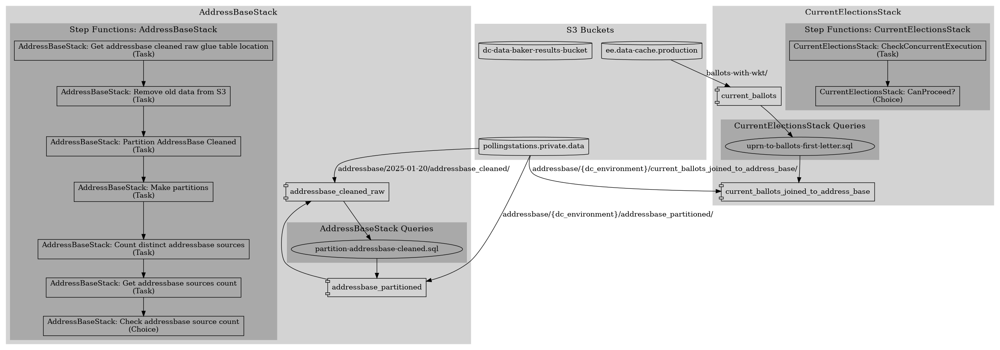

# DC Data Baker

Orchestration for writing files to s3 to power our APIs

## What this makes



(Update his graph by running `python make_graph.png`)

## Install

### Python dependencies

This project uses a pip tools style workflow.
Use [`uv`](https://github.com/astral-sh/uv) or [`pip-tools`](https://github.com/jazzband/pip-tools).
Commands given using `uv`. See [`uv` equivalence]() for comparison.

```shell
uv venv --prompt . .venv
uv pip sync requirements/dev.txt
```

### Commit hooks

```shell
pre-commit install
```

### Javascript dependencies

We're using CDK so you need the cdk tooling.

Probably best to use `nvm` to manage `npm` to manage installing libraries.

Then
```shell
nvm use --lts
npm install
```

## Managing dependencies

### `uv` equivalence

* `uv pip compile` is equivalent to `pip-compile`
* `uv pip sync` is equivalent to `pip-sync`
* `uv venv` is equivalent to `python -m venv`

### Generate requirements/*.txt files

#### base.txt
`uv pip compile --generate-hashes --output-file requirements/base.txt requirements/base.in`

#### dev.txt
`uv pip compile --generate-hashes --output-file requirements/dev.txt requirements/base.in requirements/dev.in`

### Upgrade all dependencies
* Run `uv pip compile --generate-hashes --upgrade --output-file requirements/base.txt requirements/base.in`

### Upgrade a single dependency
* Run `uv pip compile --generate-hashes --upgrade-package <pkg-name> --output-file requirements/base.txt requirements/base.in`

### Adding a dependency

#### base dependencies
* Add a dependency to `requirements/base.in`
* Run `uv pip compile --generate-hashes --output-file requirements/base.txt requirements/base.in`

#### dev dependencies
* Add a dependency to `requirements/dev.in`
* Run `uv pip compile --generate-hashes --output-file requirements/dev.txt requirements/base.in requirements/dev.in`


## CDK Setup

```shell
AWS_PROFILE=dev-aggregatorapi-dc DC_ENVIRONMENT=development cdk bootstrap
```

```shell
AWS_PROFILE=dev-aggregatorapi-dc DC_ENVIRONMENT=development cdk synth
```
